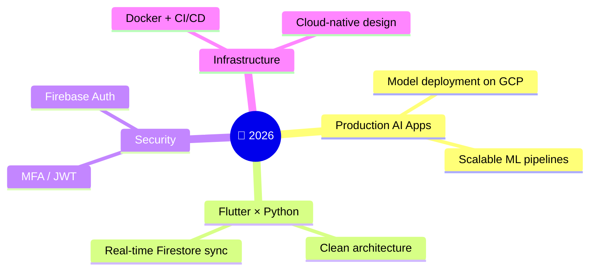

<div align="center">


🇯🇵 Japan &nbsp;•&nbsp; 🇧🇩 Bangladesh

[](https://linkedin.com/in/tanvir-ahamed-9256121b9)
[](https://github.com/tanvirkse101)

</div>

---

## ⚡ TL;DR

```python
class Tanvir:
    role       = "Software Engineer"
    focus      = ["AI/ML Systems", "Cloud-Native Backends", "Cross-Platform Apps"]
    stack      = {
        "app":     ["Flutter", "Dart"],
        "backend": ["Python", "FastAPI", "Django", "Flask"],
        "ai_ml":   ["PyTorch", "TensorFlow", "scikit-learn"],
        "cloud":   ["GCP", "Firebase", "Cloud Storage", "Docker", "CI/CD"],
        "data":    ["Firestore", "PostgreSQL", "Pandas", "NumPy"],
    }
    motto      = "It works on my machine → It works in production"
```

---

## 🛠️ What I Actually Do

|  |  |
|---|---|
| 🧠 **AI/ML Engineering** | End-to-end pipelines — preprocessing → training → deployment. Models that ship, not just notebooks. |
| ☁️ **Cloud-Native Backend** | GCP-first architecture: Firestore, Cloud Storage, Firebase Auth, containerized services. |
| 📱 **Cross-Platform Apps** | Flutter/Dart frontends wired to Python backends — clean DTOs, structured data models, real-time sync. |
| 🗄️ **Database Engineering** | Schema design, query optimization, and knowing when a document DB stops being the answer. |
| 🔐 **Secure Auth Systems** | MFA, JWT, Firebase Auth — because "we'll add security later" never happens. |
| 🚀 **DevOps & Deployment** | Docker, CI/CD, Linux. Reproducible builds, boring deploys, no 2 AM surprises. |

---

## 🧰 Arsenal

<div align="center">

**Languages**


**App & Backend**


**AI / ML / Data**


**Cloud & DevOps**


**Databases**


</div>

---

## 🎯 Current Focus



---

## 📊 GitHub Stats

<div align="center">


</div>

---

## 🎮 Outside the Terminal

`Anime` &nbsp;•&nbsp; `Video Games` &nbsp;•&nbsp; `Music` &nbsp;•&nbsp; `Overthinking system architecture for fun`

---

<div align="center">

### 💬 *"Deploy it properly, or don't deploy it at all."*


</div>
