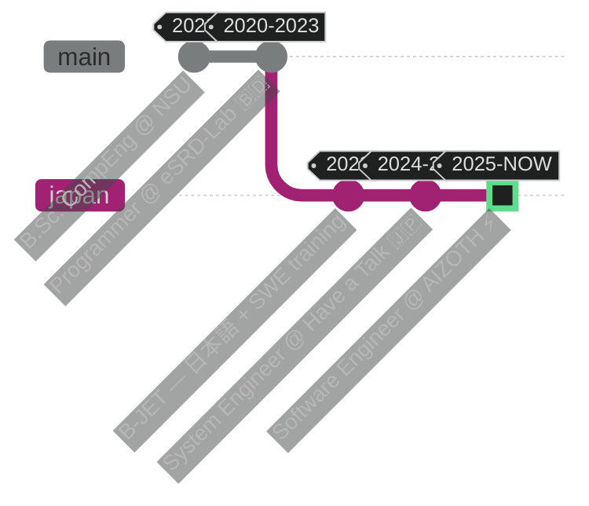

<div align="center">

<!-- ═══════════════════ ANIMATED HEADER ═══════════════════ -->


<!-- ═══════════════════ TYPING TERMINAL ═══════════════════ -->
<a href="https://github.com/tanvirkse101">

</a>

<br/><br/>

<!-- ═══════════════════ CONTACT BADGES ═══════════════════ -->
[](https://www.linkedin.com/in/tanvirkse)
[](https://tanvirkse101.github.io/portfolio/)
[](mailto:tanvirahamedkse@gmail.com)
[](https://github.com/tanvirkse101)

<code>🇯🇵 日本語 OK</code> <code>🇬🇧 English OK</code> <code>🇧🇩 বাংলা OK</code>

<br/>

<!-- ═══════════════════ OPEN-TO-WORK MARQUEE ═══════════════════ -->


</div>

<!-- ═══ ANIMATED DIVIDER ═══ -->


##  `$ whoami`

```python
class TanvirAhamed(SoftwareEngineer):
    """Full-stack engineer who cares about clean code, reliability, and learning something new every day."""

    def __init__(self):
        self.location   = "Tsukuba, Ibaraki, Japan 🗾"
        self.current    = "Software Engineer @ AIZOTH Inc."
        self.journey    = ["eSRD-Lab 🇧🇩", "B-JET 🇧🇩→🇯🇵", "Have a Talk Inc. 🇯🇵", "AIZOTH Inc. 🇯🇵"]
        self.degree     = "B.Sc. Computer Engineering — North South University"
        self.languages  = {"English": "Full Professional", "日本語": "Professional", "বাংলা": "Native"}

    def daily_stack(self) -> dict:
        return {
            "backend":   ["Python", "Django", "Flask", "FastAPI", "Laravel", "Rails", "Spring Boot"],
            "frontend":  ["Flutter", "TypeScript", "Angular"],
            "ai_ml":     ["PyTorch", "TensorFlow", "scikit-learn", "Pandas", "NumPy"],
            "cloud":     ["GCP", "Firebase", "AWS", "Docker", "CI/CD", "Linux"],
            "databases": ["PostgreSQL", "MySQL", "MongoDB", "Firestore", "Redis"],
        }

    def motto(self) -> str:
        return "Write it carefully, test it honestly, and keep learning."
```

<!-- ═══ ANIMATED DIVIDER ═══ -->


##  `$ git log --career`



<table align="center">
<tr>
<td>

```diff
+ ⚡ AIZOTH Inc. — Software Engineer (NOW)
! AI-driven products · Python · Flutter · GCP
! Tsukuba, Japan — contributing to real-world AI tools
```

</td>
<td>

```diff
+ 🔐 Have a Talk Inc. — System Engineer
! Laravel · Rails · PostgreSQL · Redis · AWS
! MFA (WebAuthn/SMS) · REST APIs · Docker
```

</td>
</tr>
<tr>
<td>

```diff
+ 🧪 eSRD-Lab — Programmer
! Django · Flask · Angular · D3.js dashboards
! eLearning + clinical data platforms
```

</td>
<td>

```diff
+ 🎌 B-JET — Japan Bridge Program
! Japanese language + business training
! Programming contests · image/data analysis
```

</td>
</tr>
</table>

<!-- ═══ ANIMATED DIVIDER ═══ -->


##  `$ cat /proc/skills`

<div align="center">

**⚙️ LANGUAGES**


**🚀 FRAMEWORKS**


**🧠 AI / ML**


**☁️ CLOUD & DEVOPS**


**🗄️ DATABASES**


</div>

<!-- ═══ ANIMATED DIVIDER ═══ -->


##  `$ ./snake --feed contributions`

<div align="center">
<picture>
  <source media="(prefers-color-scheme: dark)" srcset="https://raw.githubusercontent.com/tanvirkse101/tanvirkse101/output/github-snake-dark.svg"/>
  <source media="(prefers-color-scheme: light)" srcset="https://raw.githubusercontent.com/tanvirkse101/tanvirkse101/output/github-snake.svg"/>
  
</picture>
</div>

<!-- ═══ ANIMATED DIVIDER ═══ -->


##  `$ htop --github`

<div align="center">

<!-- 📊 Self-generated stats — served from this repo, never rate-limited -->


<br/>


<br/><br/>

<!-- ⚡ ANIMATED CONTRIBUTION PULSE -->


</div>

<!-- ═══ ANIMATED DIVIDER ═══ -->


##  `$ ls ~/trophy_room`

<div align="center">

<!-- 🏆 Self-generated achievements — served from this repo, never rate-limited -->


</div>

<!-- ═══ ANIMATED DIVIDER ═══ -->


##  `$ systemctl status tanvir`

```console
● tanvir.service — Software Engineer
     Loaded: loaded (/etc/brain/tanvir.service; enabled; vendor preset: curious)
     Active: active (running) since Oct 2020 — 5+ years of steady growth
   Main PID: 101 (learning-first mindset)
      Tasks: always a few in progress
     Memory: mostly Python bytecode and Flutter widgets
        CPU: happily busy reading new AI papers

 ├─ working on  : AI applications @ AIZOTH Inc. 🗾
 ├─ improving   : ML pipelines · cloud architecture · 日本語
 ├─ speaking    : English · 日本語 · বাংলা
 └─ off-duty    : anime ⛩ · video games 🎮 · music 🎧 · reading about architecture
```

<!-- ═══ ANIMATED DIVIDER ═══ -->


##  `$ fortune | cowsay`

<div align="center">


</div>

<br/>

<div align="center">

```
╔══════════════════════════════════════════════════════════╗
║   "STAY CURIOUS. BUILD CAREFULLY. KEEP LEARNING."  🌱    ║
╚══════════════════════════════════════════════════════════╝
```

<!-- ═══════════════════ ANIMATED FOOTER ═══════════════════ -->


</div>
